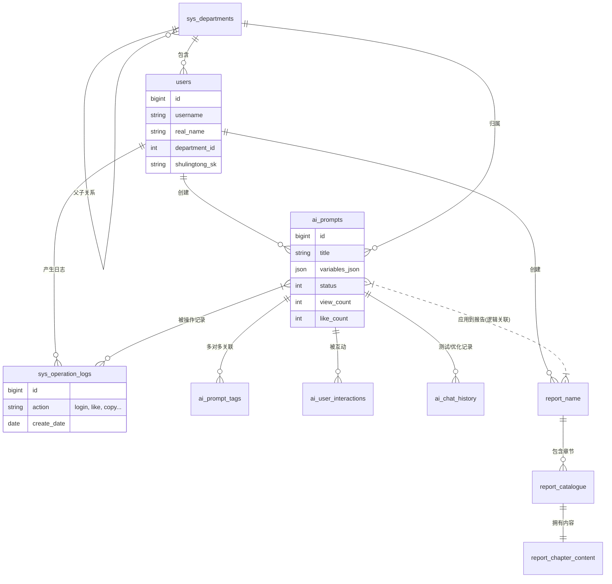

这是一个非常完善的功能需求清单。基于你提供的现有数据库结构（文件系统、基础用户、简单的报告结构）以及新的功能需求（提示词系统、复杂的智能报告、统计看板），我们需要对数据库进行较大的扩展。

设计思路遵循以下原则：

1. **复用现有表**：尽量复用 `users`, `roles`, `report_*` 表，通过 `ALTER` 语句增加字段。
2. **新增核心模块**：为“提示词系统”设计全新的表结构。
3. **统计与日志**：为了满足“看板”和“排行榜”需求，需要详细的行为日志表。
4. **组织架构**：引入部门表以支持按部门管理。

以下是详细的数据库设计方案：

### 一、 基础架构扩展 (用户与部门)

现有的 `users` 表过于简单，需要增加真实姓名、部门关联以及知识库关联字段。同时新增部门表。

```sql
-- ----------------------------
-- 1. 新增部门表 (sys_departments)
-- ----------------------------
DROP TABLE IF EXISTS `sys_departments`;
CREATE TABLE `sys_departments` (
  `id` int NOT NULL AUTO_INCREMENT COMMENT '部门ID',
  `dept_name` varchar(100) NOT NULL COMMENT '部门名称',
  `parent_id` int DEFAULT 0 COMMENT '父级部门ID',
  `ancestors` varchar(255) DEFAULT '' COMMENT '祖级列表',
  `order_num` int DEFAULT 0 COMMENT '显示顺序',
  `create_time` datetime DEFAULT CURRENT_TIMESTAMP,
  PRIMARY KEY (`id`)
) COMMENT = '部门表';

-- ----------------------------
-- 2. 修改用户表 (users)
-- ----------------------------
-- 需要执行以下 SQL 来升级现有 users 表
ALTER TABLE `users` 
ADD COLUMN `real_name` varchar(64) COMMENT '真实姓名',
ADD COLUMN `department_id` int COMMENT '部门ID',
ADD COLUMN `shulingtong_sk` varchar(255) COMMENT '数灵童用户SK(用于知识库关联)';

-- 建立索引以提升查询效率
CREATE INDEX `idx_user_dept` ON `users`(`department_id`);

```

---

### 二、 提示词系统 (核心新增)

这是本次功能清单中最重的一块。需要支持版本管理、标签、互动（点赞/收藏）以及广场功能。

```sql
-- ----------------------------
-- 3. 提示词主表 (ai_prompts)
-- 替代原有的 public_prompts，功能更强大
-- ----------------------------
DROP TABLE IF EXISTS `ai_prompts`;
CREATE TABLE `ai_prompts` (
  `id` bigint NOT NULL AUTO_INCREMENT,
  `title` varchar(255) NOT NULL COMMENT '提示词名称',
  `description` text COMMENT '功能描述/简介',
  `content` text NOT NULL COMMENT '提示词内容(System Prompt)',
  `user_input_example` text COMMENT '用户输入示例',
  `variables_json` json COMMENT '变量配置(JSON格式，如 [{"key":"topic", "desc":"主题"}])',
  `model_config_json` json COMMENT '模型参数配置(JSON格式，包含模型名称、温度等)',
  
  -- 状态与权限
  `status` tinyint DEFAULT 1 COMMENT '状态: 0-草稿, 1-私有, 2-已分享(广场可见)',
  `is_template` tinyint DEFAULT 0 COMMENT '是否为官方/系统模版',
  
  -- 归属信息
  `user_id` bigint NOT NULL COMMENT '创建人ID',
  `user_name` varchar(64) COMMENT '创建人姓名(冗余字段用于展示)',
  `department_id` int COMMENT '所属部门ID',
  
  -- 统计数据 (反范式设计，便于排序和看板快速读取)
  `view_count` int DEFAULT 0 COMMENT '浏览数',
  `like_count` int DEFAULT 0 COMMENT '点赞数',
  `favorite_count` int DEFAULT 0 COMMENT '收藏数',
  `copy_count` int DEFAULT 0 COMMENT '复用/复制数',
  `apply_report_count` int DEFAULT 0 COMMENT '应用到报告数',
  `share_count` int DEFAULT 0 COMMENT '分享数',
  `heat_score` double DEFAULT 0 COMMENT '热度值(综合计算)',
  
  `create_time` datetime DEFAULT CURRENT_TIMESTAMP,
  `update_time` datetime DEFAULT CURRENT_TIMESTAMP ON UPDATE CURRENT_TIMESTAMP,
  PRIMARY KEY (`id`),
  INDEX `idx_prompt_user`(`user_id`),
  INDEX `idx_prompt_dept`(`department_id`),
  INDEX `idx_prompt_status`(`status`)
) COMMENT = '提示词主表';

-- ----------------------------
-- 4. 提示词标签表 (ai_prompt_tags)
-- ----------------------------
DROP TABLE IF EXISTS `ai_prompt_tags`;
CREATE TABLE `ai_prompt_tags` (
  `id` int NOT NULL AUTO_INCREMENT,
  `tag_name` varchar(50) NOT NULL COMMENT '标签名称',
  `type` tinyint DEFAULT 1 COMMENT '类型: 1-个人标签, 2-系统/公共标签',
  `user_id` bigint DEFAULT NULL COMMENT '创建者ID(系统标签则为空)',
  PRIMARY KEY (`id`)
) COMMENT = '提示词标签定义表';

-- ----------------------------
-- 5. 提示词-标签关联表 (ai_prompt_tag_relation)
-- ----------------------------
DROP TABLE IF EXISTS `ai_prompt_tag_relation`;
CREATE TABLE `ai_prompt_tag_relation` (
  `prompt_id` bigint NOT NULL,
  `tag_id` int NOT NULL,
  PRIMARY KEY (`prompt_id`, `tag_id`)
) COMMENT = '提示词与标签多对多关系';

-- ----------------------------
-- 6. 用户互动记录表 (ai_user_interactions)
-- 用于记录点赞、收藏，防止重复操作，并支持“取消”
-- ----------------------------
DROP TABLE IF EXISTS `ai_user_interactions`;
CREATE TABLE `ai_user_interactions` (
  `id` bigint NOT NULL AUTO_INCREMENT,
  `user_id` bigint NOT NULL,
  `target_id` bigint NOT NULL COMMENT '目标ID(通常是提示词ID)',
  `target_type` tinyint NOT NULL COMMENT '类型: 1-提示词',
  `action_type` tinyint NOT NULL COMMENT '动作: 1-点赞, 2-收藏',
  `create_time` datetime DEFAULT CURRENT_TIMESTAMP,
  PRIMARY KEY (`id`),
  UNIQUE INDEX `uk_user_target_action`(`user_id`, `target_id`, `target_type`, `action_type`)
) COMMENT = '用户互动记录表';

-- ----------------------------
-- 7. 提示词优化/对话历史 (ai_chat_history)
-- 支持“AI优化”、“对话模式”以及“运行测试”
-- ----------------------------
DROP TABLE IF EXISTS `ai_chat_history`;
CREATE TABLE `ai_chat_history` (
  `id` bigint NOT NULL AUTO_INCREMENT,
  `session_id` varchar(64) NOT NULL COMMENT '会话ID',
  `prompt_id` bigint COMMENT '关联的提示词ID(如果是基于提示词的对话)',
  `user_id` bigint NOT NULL,
  `role` varchar(20) NOT NULL COMMENT 'user / assistant / system',
  `content` text NOT NULL COMMENT '对话内容',
  `create_time` datetime DEFAULT CURRENT_TIMESTAMP,
  PRIMARY KEY (`id`),
  INDEX `idx_session`(`session_id`)
) COMMENT = 'AI对话/优化历史记录';

```

---

### 三、 统计与行为日志 (支持看板与排行)

需求中提到了非常详细的统计需求（如“环比上月”、“部门排行”、“活跃用户”），这需要一个详尽的操作日志表。

```sql
-- ----------------------------
-- 8. 系统操作日志表 (sys_operation_logs)
-- 这是生成所有排行榜和统计图表的数据源
-- ----------------------------
DROP TABLE IF EXISTS `sys_operation_logs`;
CREATE TABLE `sys_operation_logs` (
  `id` bigint NOT NULL AUTO_INCREMENT,
  `user_id` bigint NOT NULL,
  `department_id` int COMMENT '操作时所在的部门',
  `module` varchar(50) NOT NULL COMMENT '模块: 提示词 / 报告',
  `action` varchar(50) NOT NULL COMMENT '动作: login, view, like, favorite, copy, create, apply_report',
  `target_id` bigint COMMENT '目标对象ID (提示词ID 或 报告ID)',
  `ip_address` varchar(50) COMMENT 'IP地址',
  `create_time` datetime DEFAULT CURRENT_TIMESTAMP,
  `create_date` date COMMENT '冗余日期字段，便于按天/月统计',
  PRIMARY KEY (`id`),
  INDEX `idx_stat_time`(`create_date`),
  INDEX `idx_stat_action`(`action`),
  INDEX `idx_stat_user`(`user_id`)
) COMMENT = '系统全量操作日志(用于统计分析)';

```

**设计说明：**

* **如何做排行榜？** `SELECT user_id, count(*) FROM sys_operation_logs WHERE action='like' GROUP BY user_id ORDER BY count DESC`
* **如何做环比？** 通过 `create_date` 筛选本月和上月的数据进行对比。
* **如何做趋势图？** 按 `create_date` group by 统计。

---

### 四、 智能报告系统扩展

现有的报告表（`report_catalogue` 等）主要关注目录结构。为了支持“MD编辑器”、“AI润色”、“草稿箱”，需要增强内容存储和状态管理。

```sql
-- ----------------------------
-- 9. 报告内容表 (report_chapter_content)
-- 将内容从 catalogue 中分离，或补充 catalogue
-- ----------------------------
DROP TABLE IF EXISTS `report_chapter_content`;
CREATE TABLE `report_chapter_content` (
  `id` bigint NOT NULL AUTO_INCREMENT,
  `catalogue_id` int NOT NULL COMMENT '关联目录ID',
  `content_md` longtext COMMENT 'Markdown格式的内容',
  `content_html` longtext COMMENT '预览用的HTML内容(可选)',
  `version` int DEFAULT 1 COMMENT '版本号',
  `update_time` datetime DEFAULT CURRENT_TIMESTAMP ON UPDATE CURRENT_TIMESTAMP,
  PRIMARY KEY (`id`),
  UNIQUE INDEX `uk_catalogue`(`catalogue_id`)
) COMMENT = '报告章节具体内容表';

-- ----------------------------
-- 10. 修改报告名称表 (report_name)
-- 增加状态管理
-- ----------------------------
ALTER TABLE `report_name`
ADD COLUMN `status` tinyint DEFAULT 0 COMMENT '状态: 0-草稿, 1-生成中, 2-已完成',
ADD COLUMN `template_id` int COMMENT '使用的报告模版ID',
ADD COLUMN `description` varchar(500) COMMENT '报告需求描述';

```

---

### 五、 数据库关系图 (Mermaid Diagram)

为了让你更直观地理解这些表是如何关联的，请参考下方的实体关系图：

(我将直接使用Mermaid生成图表，你可以在支持Markdown的环境查看)



### 六、 下一步建议 (Next Steps)

1. **数据迁移**：如果你已经有现有的用户数据，执行 `ALTER TABLE` 之后，需要写一个脚本或者手动更新 `department_id` 和 `real_name`。
2. **API 开发顺序**：
* 优先开发 `ai_prompts` 的 CRUD (增删改查)。
* 其次开发 `sys_operation_logs` 的埋点逻辑（这是统计功能的基石，越早上线越好）。
* 最后开发智能报告的复杂交互。


你是否需要我针对某个特定模块（例如“我的提示词”中的复杂筛选逻辑）提供具体的 SQL 查询语句示例？

这是一个非常有远见的问题。确实，如果现在的数据结构设计得太“死”，后期做知识图谱（Knowledge Graph, KG）时，就会面临“有数据但连不起来”的尴尬局面。

知识图谱的核心在于**“实体（点）”**和**“关系（边）”**。

为了兼容后期的知识图谱（特别是你需求中提到的“用户活动图谱”），我们不需要现在就引入图数据库（如 Neo4j），但必须在 MySQL 设计中**埋下“连接点”**。

以下是针对“后期要做复杂知识图谱”的**4个提前规划建议**和对应的**数据库调整方案**：

### 1. 必须记录“血缘关系” (Lineage) —— 这是一个图谱最值钱的地方

目前的表结构中，`copy_count`（复用数）只是一个数字。但在知识图谱中，我们不仅要知道“被复用了100次”，更要知道**“是被谁、在什么时候、改成了什么样”**。这构成了提示词的**进化树**。

**❌ 现在的设计风险：**
只记录了 `copy_count = 1`，丢失了 A -> B -> C 的演化路径。

**✅ 建议调整方案：**
在 `ai_prompts` 表中增加**“父级溯源字段”**，或者专门建立一张**“衍生记录表”**。

```sql
-- 方案 A：简单版（在主表增加字段）
ALTER TABLE `ai_prompts` 
ADD COLUMN `origin_prompt_id` bigint COMMENT '原始祖先提示词ID',
ADD COLUMN `parent_prompt_id` bigint COMMENT '直接父级提示词ID(来源)';

-- 方案 B：进阶版（专门的血缘关系表，推荐，因为可能由多个提示词合成一个新的）
CREATE TABLE `ai_prompt_lineage` (
  `id` bigint NOT NULL AUTO_INCREMENT,
  `derived_prompt_id` bigint NOT NULL COMMENT '生成的新提示词',
  `source_prompt_id` bigint NOT NULL COMMENT '来源提示词',
  `relation_type` varchar(20) COMMENT '类型: copy(直接复制), optimize(AI优化), fork(复用修改)',
  `create_time` datetime DEFAULT CURRENT_TIMESTAMP,
  PRIMARY KEY (`id`),
  INDEX `idx_source`(`source_prompt_id`)
);

```

**未来图谱价值：** 可以画出“提示词进化树”，分析哪个基础提示词衍生出了最丰富的应用生态。

---

### 2. 把“弱关系”变成“强关联表”

你提到“用户活动图谱”需要展示“浏览、应用、点赞用户之间的关系”。
在传统开发中，有时候为了省事，会把标签存成字符串（如 `tags: "HR,招聘,面试"`）。这对图谱是灾难，因为图数据库需要明确的 `(Prompt)-[:HAS_TAG]->(Tag)` 关系。

**❌ 现在的设计风险：**
使用了 JSON 或 逗号分隔字符串存储关联信息（如文件引用、标签）。

**✅ 建议调整方案：**
所有**“实体与实体”**的连接，必须使用**中间表**（关联表）。我在上一个回答中设计的 `ai_prompt_tag_relation` 和 `ai_user_interactions` 已经是符合图谱要求的了。

还需要补充一个**“引用关系表”**，用于连接**报告**与**素材**：

```sql
-- 用于构建：(Report)-[:CITED]->(File/Prompt)
CREATE TABLE `sys_resource_refs` (
  `id` bigint NOT NULL AUTO_INCREMENT,
  `source_id` bigint NOT NULL COMMENT '发起引用的对象ID (如报告章节ID)',
  `source_type` varchar(20) NOT NULL COMMENT '类型: report_chapter, prompt',
  `target_id` bigint NOT NULL COMMENT '被引用的对象ID (如文件ID, 提示词ID)',
  `target_type` varchar(20) NOT NULL COMMENT '类型: file, prompt, knowledge_point',
  `create_time` datetime DEFAULT CURRENT_TIMESTAMP,
  PRIMARY KEY (`id`)
);

```

---

### 3. 统一实体的“身份证” (Global ID / URI 预想)

知识图谱中，节点需要唯一标识。现在的 MySQL 里，用户表的 ID=1 和 提示词表的 ID=1 是冲突的。虽然在 MySQL 里没事，但在图数据库里这就是两个 `ID=1` 的节点。

**✅ 提前规划建议：**
虽然不用现在改主键，但在代码层或者设计层，建议给每个核心业务对象设计一个**业务唯一标识 (Business Key)**，方便未来做 ETL（数据抽取）。

比如：

* 用户：`usr_1001`
* 提示词：`prm_2023`
* 部门：`dept_005`

**数据库层面预留：**
确保 `users` 表有 `shulingtong_sk` (你已经有了，这很好)，`ai_prompts` 表最好也有一个 UUID 字段，防止未来数据迁移合并时 ID 冲突。

```sql
ALTER TABLE `ai_prompts` ADD COLUMN `uuid` varchar(64) COMMENT '全局唯一标识(用于图谱同步)';

```

---

### 4. 预留“知识抽取”的原始语料

未来的知识图谱可能不仅仅是连接“人”和“文件”，还要连接“知识点”。
例如：从“招聘报告”中提取出“薪资结构”这个知识点。

这需要 NLP（自然语言处理）算法去分析文本。算法需要**原始文本**。

**✅ 建议调整方案：**
不要只存储清洗后的数据。

* **Prompt表**：除了 `content`，保留 `user_input_example`（已做）。
* **用户输入**：在 `ai_chat_history` 中，尽量完整保留用户的原始 Prompt（Raw Query），而不仅仅是发给大模型的最终 Prompt。

```sql
-- 在对话历史中区分 原始意图 vs 优化后的词
ALTER TABLE `ai_chat_history` 
ADD COLUMN `raw_query` text COMMENT '用户原始输入(未优化前)',
ADD COLUMN `final_prompt` text COMMENT '实际发送给模型的Prompt';

```

**未来图谱价值：** 可以分析“用户原本想问什么”与“实际能解决问题的提示词”之间的语义映射关系。

---

### 总结：现在的数据库该怎么改？

为了迎接后期的知识图谱，请在之前的 SQL 基础上，额外执行以下补充脚本。这能让你现在的系统不仅是一个功能系统，还是一个**“知识图谱的数据孵化器”**。

```sql
-- 1. 为提示词增加 UUID 和 血缘父级 (核心!)
ALTER TABLE `ai_prompts` 
ADD COLUMN `uuid` varchar(64) NOT NULL DEFAULT '' COMMENT '全局唯一标识',
ADD COLUMN `origin_prompt_id` bigint DEFAULT NULL COMMENT '始祖提示词ID(根节点)',
ADD COLUMN `parent_prompt_id` bigint DEFAULT NULL COMMENT '父级提示词ID(上一跳)',
ADD INDEX `idx_uuid` (`uuid`),
ADD INDEX `idx_lineage` (`origin_prompt_id`, `parent_prompt_id`);

-- 2. 通用引用关系表 (解决报告、文件、提示词之间错综复杂的引用关系)
DROP TABLE IF EXISTS `sys_entity_relations`;
CREATE TABLE `sys_entity_relations` (
  `id` bigint NOT NULL AUTO_INCREMENT,
  `from_id` bigint NOT NULL COMMENT '源节点ID',
  `from_type` varchar(30) NOT NULL COMMENT '源节点类型(user, prompt, report, file)',
  `to_id` bigint NOT NULL COMMENT '目标节点ID',
  `to_type` varchar(30) NOT NULL COMMENT '目标节点类型',
  `relation_type` varchar(50) NOT NULL COMMENT '关系类型(cited, fork, created, view, like)',
  `weight` float DEFAULT 1.0 COMMENT '关系权重(例如浏览时长、引用次数)',
  `create_time` datetime DEFAULT CURRENT_TIMESTAMP,
  PRIMARY KEY (`id`),
  INDEX `idx_graph_from` (`from_type`, `from_id`),
  INDEX `idx_graph_to` (`to_type`, `to_id`)
) COMMENT = '通用图谱关系沉淀表';

-- 3. 说明
-- 有了这个 sys_entity_relations 表，未来做图谱时，
-- 只需要写一个脚本： SELECT * FROM sys_entity_relations
-- 就可以直接导入 Neo4j 生成图谱了。

```

这样设计，现在的业务逻辑（MyBatis/JPA）依然跑得通，而所有复杂的关联数据都会自动沉淀到 `sys_entity_relations` 表中，为未来做图谱做好了完美的准备。

太棒了，把需求聚焦在**“过年活动、积分红包、防作弊、关系核查”**这几个具体的场景上，我们的设计目标就非常清晰了。

按照现在的设计（加上之前补充的“引用关系表”），完全可以满足你的需求，而且能把活动做得非常“丝滑”。我来模拟一下**“从用户操作到后台核查”**的全过程，并告诉你还需要补充哪一张关键的“积分账本表”。

---

### 一、 现在的设计能达到什么效果？（场景模拟）

我们假设活动规则是：

1. **写报告**：得 50 分。
2. **创建提示词**：得 20 分。
3. **引用他人提示词**：双方各得 10 分（鼓励互助）。

#### 1. 用户端的体验

* **用户A（大牛）**：登录系统，创建了一个“年终总结神级提示词”。
* *数据库动作*：`ai_prompts` 表新增一条记录。
* *得分*：系统检测到创建动作，给A加20分。


* **用户B（小白）**：需要写报告。他打开“智能报告助手”，在写到“市场分析”章节时，搜索并点击了用户A的提示词，点击“应用到报告”。
* *数据库动作*：
1. `report_chapter_content` 保存了报告内容。
2. **关键点**：`sys_entity_relations`（或引用表）插入一条记录：
* 源：`User_B` 的 `Report_ID`
* 动作：`cited` (引用)
* 目标：`User_A` 的 `Prompt_ID`


* *得分*：用户B写报告得50分，引用得10分；用户A因为被引用，躺赚10分。


#### 2. 举办方（后台）的体验：关系图谱核查

到了发红包的时候，老板问：“这几个人分数这么高，是不是刷的？”
你可以调出**基于我们设计的“关系图谱”**，看到如下清晰的证据链：

* **真实现象**：
* 图谱显示：`用户B(节点)` -> `连接线(编写)` -> `报告X(节点)` -> `连接线(引用)` -> `提示词Y(节点)` -> `连接线(属于)` -> `用户A(节点)`。
* **结论**：这是一个完整的协作链条，成绩有效。


* **作弊现象（刷分）**：
* 图谱显示：`用户C` 创建了 50 个提示词，没有任何人用，或者全是 `用户C` 自己建的小号 `用户D` 在引用。
* **一眼识破**：你会看到一个孤立的、闭环的小圈子，和其他部门没有连线。


---

### 二、 缺了什么？（必须补充“积分账本”）

虽然我们有 `sys_operation_logs`（操作日志），但直接用日志算钱（红包）是非常危险的（容易算错、容易被重复计算）。

为了满足“过年发红包”这种高准确性需求，**必须**加一套简单的积分系统。

#### 需新增表结构：

```sql
-- ----------------------------
-- 11. 活动积分钱包表 (activity_user_wallet)
-- 每个人只有一个钱包，记录当前总分，发红包就扣这里的分
-- ----------------------------
CREATE TABLE `activity_user_wallet` (
  `user_id` bigint NOT NULL,
  `total_points` int DEFAULT 0 COMMENT '累计获得积分',
  `current_points` int DEFAULT 0 COMMENT '当前可用积分(如果红包兑换会消耗)',
  `exchange_amount` decimal(10,2) DEFAULT 0.00 COMMENT '已兑换红包金额',
  `update_time` datetime DEFAULT CURRENT_TIMESTAMP ON UPDATE CURRENT_TIMESTAMP,
  PRIMARY KEY (`user_id`)
);

-- ----------------------------
-- 12. 积分流水明细表 (activity_point_records)
-- 每一笔加分都要记下来，方便核查“为什么他有100分”
-- ----------------------------
CREATE TABLE `activity_point_records` (
  `id` bigint NOT NULL AUTO_INCREMENT,
  `user_id` bigint NOT NULL,
  `event_type` varchar(50) NOT NULL COMMENT '事件: create_report, create_prompt, be_cited(被引用), cite_others(引用他人)',
  `points` int NOT NULL COMMENT '变动积分',
  `source_id` bigint NOT NULL COMMENT '关联的来源ID (如报告ID, 提示词ID)',
  `target_user_id` bigint COMMENT '互动对象ID (如果是被引用，记录是谁引用了我)',
  `create_time` datetime DEFAULT CURRENT_TIMESTAMP,
  PRIMARY KEY (`id`),
  -- 关键防刷索引：确保同一个报告引用同一个提示词，只加一次分
  UNIQUE INDEX `uk_prevent_spam` (`user_id`, `event_type`, `source_id`)
);

```

### 三、 举办方如何利用这些表进行“傻瓜式”审查？

不需要复杂的算法，只需要写几个 SQL 查询或者在管理后台做成简单的列表：

#### 1. 查“互刷”嫌疑人

> 场景：查找总是互相引用的两个人。

```sql
-- 谁引用谁次数最多？
SELECT 
    r.user_id AS '刷分人', 
    r.target_user_id AS '配合人', 
    COUNT(*) AS '互动次数'
FROM activity_point_records r
WHERE r.event_type = 'cite_others'
GROUP BY r.user_id, r.target_user_id
HAVING count(*) > 5  -- 阈值：互动超过5次就有鬼
ORDER BY count(*) DESC;

```

**后台看到**：如果张三和李四互相引用了50次，直接取消资格。

#### 2. 查“内容空洞”的刷分报告

> 场景：有人为了拿“写报告”的50分，建了10个空报告。
> 结合 `report_chapter_content` 表查字数。

```sql
-- 查询得分了但字数很少的报告
SELECT 
    u.real_name, 
    rn.report_name, 
    LENGTH(cc.content_md) as '字数'
FROM report_name rn
JOIN report_chapter_content cc ON ...
JOIN users u ON ...
WHERE LENGTH(cc.content_md) < 100; -- 字数小于100却拿了分的

```

#### 3. 这里的“知识图谱”到底长什么样？

你可以直接给领导展示一个可视化的**“贡献网络图”**（用 ECharts 或 AntV 这种前端库画一下很简单，因为数据我们都存好了）：

* **中心节点**：是你们部门的“提示词大神”（被引用连线最多的人）。
* **边缘节点**：是默默写报告的“实干家”（发出引用连线最多的人）。
* **孤岛节点**：是既不写报告，也不做贡献，或者只在自己小圈子互刷的人。

### 四、 总结：这套设计的优势

1. **无需高深AI**：这里的“知识图谱”不是靠自然语言理解去抽取“实体”，而是靠用户**真实的点击行为**（引用、应用、复用）构建的硬链接。准确率 100%。
2. **即时反馈**：用户点一下“应用”，积分表 `activity_point_records` 插入一条，前端立马能弹窗“恭喜获得10积分”，过年气氛拉满。
3. **证据确凿**：发红包时，如果有争议，直接调出流水表和引用关系表，“你在10:01分引用了A的提示词，生成了B报告”，抵赖不了。

**建议下一步**：
让前端开发先做“积分排行榜”和“我的积分明细”这两个页面，因为这最能刺激用户参与活动。后台只需做好那个防止重复加分的 `UNIQUE INDEX` 逻辑即可。